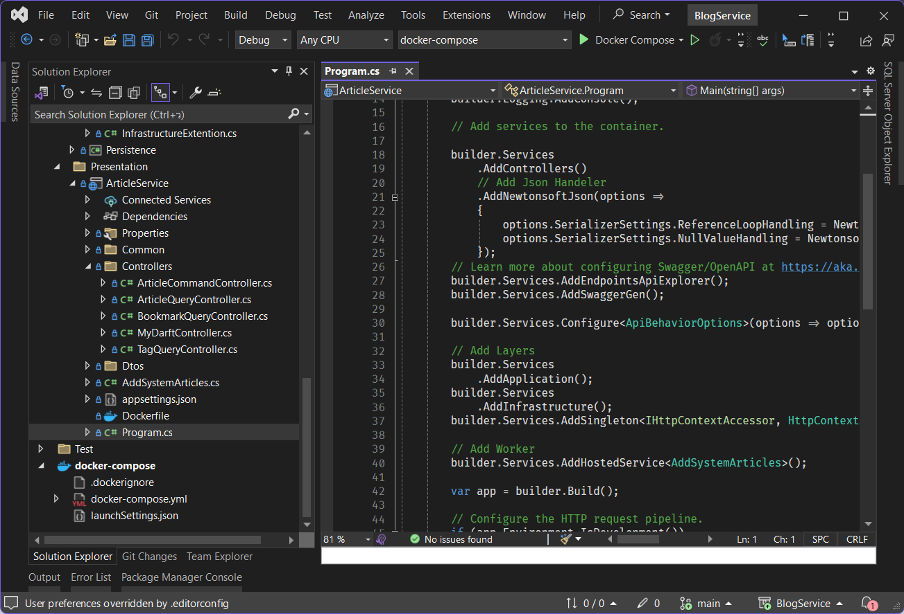

# บริการจัดการบทความ

บริการจัดการบทความพัฒนาด้วย [Visual Studio 2022](https://visualstudio.microsoft.com/vs/) และ [Docker](https://docs.docker.com/engine/install/) โดยสามารถเปิดโค้ดนี้ใน Visual Studio ได้เลย

